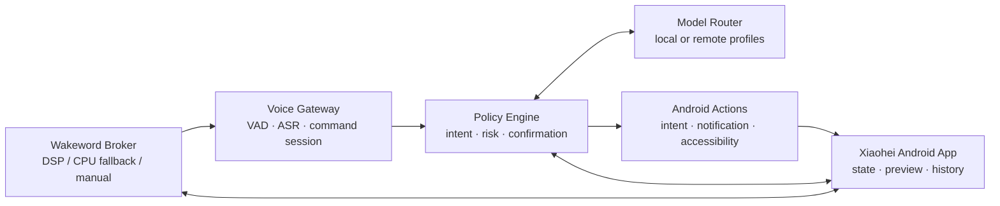

# Xiaohei Phone Agent

[简体中文](README.zh-CN.md) · [Architecture](docs/architecture.md) · [Compatibility](docs/compatibility.md) · [DSP candidates](docs/dsp-device-candidates.md) · [Roadmap](docs/roadmap.md) · [Security](SECURITY.md)

> Wake it. Say it. Let your phone act — locally when possible, visibly, and with confirmation when it matters.

Xiaohei is an open, local-first AI phone assistant for Android. It connects a user-invoked or always-on entry point, a short voice command, model-independent intent routing, explicit safety policy, and observable Android actions into one product.

**Status:** experimental product. There is no installable Xiaohei release yet. The first downloadable alpha will target ordinary Android with a button, Quick Settings tile, or assistant invocation; Qualcomm DSP is an optional device backend. Its low-power path has been validated end to end on a OnePlus 8T running Android 14 LineageOS.

**Compatibility promise:** users do not need a OnePlus phone or Qualcomm DSP for Xiaohei's base product. Unsupported wake backends are hidden or marked unavailable instead of being installed optimistically. See the [compatibility tiers](docs/compatibility.md).

## What Xiaohei should feel like

- “Xiaohei, open the gallery.” — wake the phone assistant and open the requested app.
- “Xiaohei, do I have unread WeChat messages?” — summarize notification-level unread state without crawling chats.
- “Xiaohei, draft a reply to the unread message.” — prepare a preview, explain the target, and wait for confirmation before sending.
- “Xiaohei, use my local model.” — route the task through a selected local or remote model profile without coupling model choice to service lifecycle.

## Product principles

- **Useful before privileged integration:** button, tile, headset, or assistant invocation provides a broadly compatible base mode.
- **Honest power tiers:** DSP is preferred when a verified device backend exists; CPU wake-word mode is opt-in and never advertised as equivalent low power.
- **Local first, cloud optional:** device actions and policy remain local. ASR and reasoning providers are replaceable.
- **Visible automation:** actions expose their state, target, result, and failure reason.
- **Confirmation proportional to risk:** opening an app is not treated like sending a message, deleting data, or making a purchase.
- **User-like interaction:** Android intents, notification access, and accessibility-driven clicks are preferred over private app APIs or protocol impersonation.
- **Evidence over demos:** a process, HTTP 200, or attractive UI is not accepted as an end-to-end result.

## Architecture



Xiaohei owns the product shell and orchestration. It does not duplicate the device laboratory, AI runtime, test harness, or optional Happy relay maintained by the sibling projects.

## Current evidence

| Capability | Status | Evidence boundary |
|---|---|---|
| Qualcomm ADSP/LPI wake-word path | Validated | Screen-off acoustic input reached the second-stage RNN and Android callback on OnePlus 8T |
| Clean rollback | Validated | Temporary APK, libraries, and Magisk probe removed; SoundTrigger baseline restored |
| Generic Android invocation | Next | Button, Quick Settings tile, and capability-detected assistant entry; no root required |
| Generic command-to-action core | Next | First vertical slice opens the gallery through a public Android intent |
| Minimal Android 14 DSP Broker | Advanced track | Replaces the temporary OEM probe on supported system/root profiles |
| Physical-unplug power qualification | Planned | Three DSP OFF/ARMED A/B runs plus 8–24 hour idle regression |
| Short-command ASR and intent routing | Planned | Provider-independent contract first |
| Confirmed Android action | Planned | “Open gallery” is the first low-risk vertical slice |
| Custom “Xiaohei” keyword model | Research | Must pass the same DSP, power, accuracy, and rollback gates |

## Repository layout

```text
apps/android/                 User-facing Android shell and controls
components/wakeword-broker/  SoundTrigger lifecycle and wake events
components/voice-gateway/    Short command, VAD, ASR, and session boundary
components/policy-engine/    Intent, risk, confirmation, and audit decisions
components/android-actions/  Intents, notifications, and accessibility actions
backends/wake/                Capability-tiered manual, assistant, CPU, and DSP backends
device-profiles/              Explicitly tested hardware/ROM integrations
contracts/                    Versioned, provider-neutral event schemas
docs/                         Product brief, architecture, roadmap, and assets
manifests/                    Public product and integration metadata
scripts/                      Repository verification gates
```

## Ecosystem integration

- [oneplus-8t-mobile-lab](https://github.com/toolazytoname/oneplus-8t-mobile-lab): umbrella documentation, device guides, and verified combinations.
- [android-ai-stack](https://github.com/toolazytoname/android-ai-stack): OpenCode, Claude, Happy, llama.cpp, and provider/model profiles.
- [android-device-test](https://github.com/toolazytoname/android-device-test): reusable ADB/UI evidence and acceptance harness.
- [pocket-pentest](https://github.com/toolazytoname/pocket-pentest): authorized Android/Termux/Kali device capabilities.
- [happy-relay-deploy](https://github.com/toolazytoname/happy-relay-deploy): optional remote Happy relay; not required for local Xiaohei operation.

## Compatibility tiers

| Tier | Typical device | Invocation | Root | Power boundary |
|---|---|---|---|---|
| A — Base | Ordinary Android | App button, Quick Settings tile, shortcut, headset/hardware intent where available | No | No always-on microphone |
| B — Assistant | Device lets the user select Xiaohei as assistant | System assistant gesture or button | No | OEM/system behavior varies; capability-tested at runtime |
| C — CPU KWS | Ordinary Android with explicit opt-in | Foreground wake-word service | No | Higher battery use and visible notification; not the default |
| D — DSP | Verified vendor/root/custom-ROM profile | Screen-off low-power keyword | Usually system integration | Best idle power, but device-specific |

The product UI reports the active tier. A missing Tier D backend never blocks Tier A functionality.

## Public boundary

This repository accepts source code, schemas, redacted fixtures, and reproducible verification instructions. It must not contain OEM APKs or models, proprietary shared libraries, platform signing keys, model weights, provider tokens, private endpoints, device serials, chat content, or unredacted runtime logs.

See [SECURITY.md](SECURITY.md) before contributing an action adapter. See [CONTRIBUTING.md](CONTRIBUTING.md) for the evidence and bilingual documentation requirements.

## License and trademarks

Source code and documentation in this repository are released under the [MIT License](LICENSE). Xiaohei is an independent open-source project. Android, OnePlus, WeChat, Qualcomm, Claude, OpenCode, and Happy are trademarks of their respective owners; no endorsement is implied.
