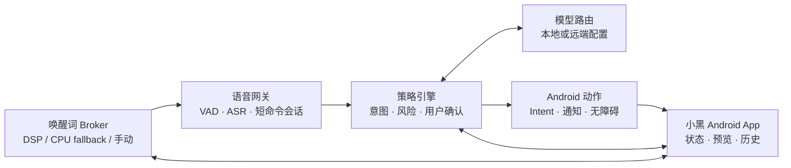

# 小黑 AI 手机助手

[English](README.md) · [架构](docs/architecture.zh-CN.md) · [兼容性](docs/compatibility.zh-CN.md) · [DSP 候选设备](docs/dsp-device-candidates.zh-CN.md) · [厂商级交付计划](docs/product-delivery-plan.zh-CN.md) · [路线图](docs/roadmap.zh-CN.md) · [安全模型](SECURITY.md)

> 唤醒它，说出需求，让手机行动——尽量本地、过程可见，高风险动作必须确认。

小黑是一款面向 Android 的开源、本地优先 AI 手机助手。它把用户主动入口或常驻唤醒、短语音命令、与模型无关的意图路由、明确的安全策略和可观察的手机操作组合成一个独立产品。

**当前状态：**实验性产品，目前还没有可安装版本。首个可下载 Alpha 面向普通 Android，先提供按钮、快捷设置和系统助手入口；Qualcomm DSP 是可选设备后端。OnePlus 8T + Android 14 LineageOS 已完成该低功耗链路的实机闭环。

**兼容性承诺：**基础版小黑不要求 OnePlus 手机或 Qualcomm DSP。不兼容的唤醒后端必须隐藏或明确显示“不支持”，不能乐观安装后再报错。详见[兼容性分层](docs/compatibility.zh-CN.md)。

## 小黑应该是什么体验

- “小黑小黑，打开相册。”——唤醒助手并打开指定应用。
- “小黑小黑，微信有没有未读消息？”——优先从通知层汇总未读状态，不遍历聊天页面。
- “小黑小黑，帮我回复未读消息。”——先生成草稿、展示收件人和内容，用户确认后再发送。
- “小黑小黑，切到本地模型。”——使用本地或远端模型配置，但模型切换不连带启停其他服务。

## 产品原则

- **先让普通设备可用：**按钮、快捷设置、耳机键或系统助手入口构成广泛兼容的基础模式。
- **诚实标注功耗层级：**有已验证设备后端时优先 DSP；CPU 唤醒词必须显式开启，不能宣传成同等级低功耗。
- **本地优先，云端可选：**设备动作和安全策略留在本机，ASR 与推理渠道可替换。
- **自动化必须可见：**展示当前状态、操作目标、执行结果和失败原因。
- **风险与确认匹配：**打开应用与发送消息、删除数据、支付不是同一级别。
- **模拟用户操作：**优先使用 Android Intent、通知访问和无障碍点击，不伪造私有协议。
- **以证据判断完成：**进程存在、HTTP 200 或页面能打开，都不能单独算端到端可用。

## 架构



小黑负责用户能看到的产品外壳与编排，不复制设备实验室、AI Runtime、真机测试框架或可选 Happy relay 的实现。

## 当前证据

| 能力 | 状态 | 证据边界 |
|---|---|---|
| Qualcomm ADSP/LPI 唤醒 | 已验证 | OnePlus 8T 息屏声学输入进入二阶段 RNN 并收到 Android callback |
| 干净回滚 | 已验证 | 临时 APK、私有库和 Magisk 探针已移除，SoundTrigger 恢复基线 |
| 通用 Android 唤起入口 | 下一步 | 按钮、快捷设置和能力探测后的系统助手入口；不需要 root |
| 通用命令到动作核心 | 下一步 | 首条纵切通过公开 Android Intent 打开相册 |
| 最小 Android 14 DSP Broker | 高级轨道 | 在支持的 system/root profile 上替换临时原厂探针 |
| 物理拔线功耗资格 | 待执行 | DSP OFF/ARMED 三轮 A/B 和 8–24 小时静置回归 |
| 短命令 ASR 与意图路由 | 规划中 | 先固定与模型无关的数据契约 |
| 带确认的 Android 动作 | 规划中 | 首个低风险纵切是“打开相册” |
| 自定义“小黑小黑”模型 | 调研中 | 必须重新通过 DSP、功耗、准确率和回滚门禁 |

## 目录结构

```text
apps/android/                 用户可见的 Android 外壳与控制入口
components/wakeword-broker/  SoundTrigger 生命周期与唤醒事件
components/voice-gateway/    短命令、VAD、ASR 和会话边界
components/policy-engine/    意图、风险、确认与审计决策
components/android-actions/  Intent、通知和无障碍动作
backends/wake/                按能力分层的手动、助手、CPU 与 DSP 后端
device-profiles/              明确通过实测的硬件/ROM 集成
contracts/                    版本化、与模型无关的数据契约
docs/                         产品说明、架构、路线图和素材
manifests/                    公开产品与跨仓集成元数据
scripts/                      仓库发布门禁
```

## 与现有体系的关系

- [oneplus-8t-mobile-lab](https://github.com/toolazytoname/oneplus-8t-mobile-lab)：伞状文档、设备教程和组合验收。
- [android-ai-stack](https://github.com/toolazytoname/android-ai-stack)：OpenCode、Claude、Happy、llama.cpp 与模型配置。
- [android-device-test](https://github.com/toolazytoname/android-device-test)：通用 ADB/UI 证据与验收框架。
- [pocket-pentest](https://github.com/toolazytoname/pocket-pentest)：经授权的 Android/Termux/Kali 设备能力。
- [happy-relay-deploy](https://github.com/toolazytoname/happy-relay-deploy)：可选远端 Happy relay；小黑本地工作不依赖它。

## 兼容性分层

| 层级 | 典型设备 | 唤起方式 | Root | 功耗边界 |
|---|---|---|---|---|
| A — 基础 | 普通 Android | App 按钮、快捷设置、快捷方式、设备支持时的耳机/硬件 Intent | 不需要 | 无常驻麦克风 |
| B — 系统助手 | 允许用户选择小黑为助手的设备 | 系统助手手势或按键 | 不需要 | OEM/系统行为不同，必须运行时探测 |
| C — CPU KWS | 用户明确开启的普通 Android | 带前台通知的唤醒词服务 | 不需要 | 更耗电，不作为默认模式 |
| D — DSP | 已验证的厂商/root/定制 ROM profile | 息屏低功耗唤醒词 | 通常需要系统集成 | 待机功耗最好，但依赖设备 |

产品界面必须显示当前层级；缺少 D 层绝不能影响 A 层使用。

## 对外发布边界

仓库只接收源码、Schema、脱敏 fixture 和可复现验证说明。禁止提交 OEM APK/模型、私有共享库、platform 签名密钥、大模型权重、Provider Token、私有 Endpoint、设备序列号、聊天内容和未脱敏运行日志。

新增动作适配器前请阅读 [SECURITY.md](SECURITY.md)，贡献与中英文文档要求见 [CONTRIBUTING.md](CONTRIBUTING.md)。

## 许可证与商标

本仓库源码和文档使用 [MIT License](LICENSE)。小黑是独立开源项目；Android、OnePlus、微信、Qualcomm、Claude、OpenCode 和 Happy 等名称归各自权利人所有，不代表官方合作或背书。
