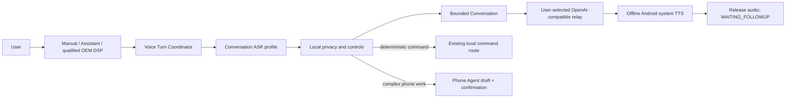

# Xiaohei free-voice conversation: executable delivery plan

[简体中文](free-voice-chat-delivery-plan.zh-CN.md) · [Executor runbook](free-voice-chat-executor-runbook.md) · [Master plan](sovereign-mobile-agent-master-plan.md) · [Execution backlog](execution-backlog.md) · [Status](../STATUS.md)

Status date: 2026-08-11. This is the implementation checklist for `CHAT-005` and related `VOICE-007/008/009/011/012` gates. It is not a completion claim. The Chinese page is the detailed execution source; this mirror preserves the public product contract and ordered work packages.

## Goal and boundary

Deliver a real, stoppable Mandarin loop on the OnePlus 8T:

> explicit wake or Talk tap → one bounded recording → conversation ASR → local privacy checks → bounded multi-turn model → offline system TTS → release all audio → wait for another explicit wake.

The first release is low-power, half-duplex, and turn-activated. Only the qualified OEM DSP path may remain ready while idle. Android must not keep a CPU microphone open merely to wait for a follow-up. Model output remains display/speech-only; phone work can only become an editable Phone Agent draft and must still pass plan, policy, confirmation, and tool-gateway checks.

## Honest baseline

- The OnePlus currently carries a private model-bearing `0.2.0-alpha.3` debug build. Never overwrite it with a generic APK that lacks ASR/KWS assets.
- The qualified offline Chinese system TTS is selected.
- The phone's Conversation profile is currently disabled and has no completed real endpoint/model/token configuration, so free conversation is not usable yet.
- Conversation already has a six-turn, 2048-estimated-token, five-minute text session, cancellation, lifecycle clearing, fixed FAQ, and offline TTS.
- Voice recognition is wired to the main command screen only. Chat routing merely pre-fills Conversation, which has no microphone control.
- The local 14M ASR always loads command hotwords and must not be reused unchanged for open dictation.
- Audio input/output leases, sentence TTS queueing, visible speech stop, and device resource-return evidence already exist; do not reimplement them.
- The selected private CC Switch profile already passed one redacted `/models` observation. Do not repeat it without a configuration change. A prior chat probe failed to retain a verdict after the request, so it is not passing evidence and must not trigger blind paid retries.
- Planning wrote no model configuration to the phone and left no UI XML.

## Delivery levels

| Level | Experience | Exit gate |
|---|---|---|
| L0 current | Text UI, fixed FAQ, offline playback | Existing; not free conversation |
| L1 model text | Real text replies with offline playback | Private profile and one bounded device smoke test |
| L2 push-to-talk | ASR → model → TTS with bounded follow-ups | `CHAT-005` automated and device evidence |
| L3 DSP per turn | Screen-off DSP wake, one turn, CPU release, re-arm | No persistent CPU recorder |
| L4 hands-free session | Continuous explicit session and audible interruption | Human echo, interruption, call, and power gates |

L2 is the minimum deliverable; L3 is the recommended default. L4 remains experimental.

The first-release state path is `IDLE → LISTENING → REVIEWING → THINKING → SPEAKING → WAITING_FOLLOWUP`. Cancel, error, lock, background, call, profile change, and global stop invalidate stale callbacks and release recorder, TTS, HTTP, and bounded text references. `SPEAKING` never opens the microphone automatically.

## Execution discipline

1. Take one dependency-ready `FVC-*` package and one small PR at a time.
2. Read this plan, `STATUS.md`, the backlog, and linked evidence before acting.
3. Preserve `docs/articles/`. Never commit credentials, private URLs, weights, APKs, raw speech, UI XML, notifications, or private logs.
4. Do not repeat `/models` for an unchanged profile. Run only the predeclared minimum real chat cases.
5. Never retry an unchanged failure fingerprint; allow one recovery after a recorded condition change.
6. Prefer semantic UI state, bounded logs, and AudioFlinger counts over screenshots.
7. Release logs contain outcome, length, latency, and generation only—not transcripts or model text.
8. Physical OnePlus builds preserve private ASR/KWS assets. Generic no-model APKs run only on independent AOSP.
9. Unit tests, target build, `bash scripts/verify.sh`, and both required GitHub checks pass before merge.
10. Hearing, echo, real-speaker ASR, routes, unplugged power, and offline recovery remain `HUMAN/VERIFY` until performed.

## Ordered work packages

### FVC-000 — Redacted baseline

- [x] Record revision/worktree state, non-secret phone/TTS/channel/DSP/CPU-KWS states, and model-bearing APK provenance/signature/hash.
- [x] Do not call the network or change phone configuration.
- [x] Set Current/Next/Blocker in `STATUS.md` without subjective percentages.

Evidence: [FVC-000 redacted baseline acceptance](acceptance-fvc-000.md).

### FVC-010 — Safe private Conversation provisioning

- [x] Select the intended CC Switch profile and keep URL/token/model only in process memory—no echo, trace, plaintext temp file, chat, or Git.
- [x] Normalize the profile to the OpenAI-compatible base expected by the client without duplicate `/v1/v1`.
- [x] Save only the independent Conversation endpoint/model/Keystore slot and system TTS.
- [x] Verify redacted enabled/non-empty/token-configured state and byte-identical Phone Agent/OpenCode/Claude/Happy/TTS-relay channels.
- [x] Used a non-echoed local process-memory handoff and the public phone UI; the token was not persisted outside Android Keystore.

Evidence: [FVC-010 Conversation private-profile isolation acceptance](acceptance-fvc-010.md).

Rollback disables Conversation and clears only its Keystore slot.

### FVC-020 — Minimal real text-model and offline-TTS loop

- [x] Run one fixed non-private short prompt requesting a Chinese sentence, one fixed language-reference follow-up, and the visible local End Chat control.
- [x] Prove `1/6`, `2/6`, ordered context, offline `SPEAKING → WAITING_FOLLOWUP`, and zero-call local clearing.
- [x] Cover cancellation and stale callbacks through the full local test suite without another paid request.
- [x] Reuse existing `CHAT-011` AOSP proof for disabled-channel FAQ/unknown fail-closed behavior instead of perturbing the working private profile.
- [x] End with no active Xiaohei recorder; the automated matrix has no Fatal/ANR.

Evidence: [FVC-020 minimal real text-model and offline-TTS loop](acceptance-fvc-020.md). Record one typed failure and do not retry unchanged. Passing establishes L1 only.

### FVC-030 — Separate command and conversation ASR profiles

- [x] Add explicit `COMMAND` and `CONVERSATION` profiles; unknown values fail closed.
- [x] Keep command hotwords/limited normalization only in `COMMAND`; open dictation must not use them.
- [x] Keep the eight-second, `zh-CN`, one-final boundary; partials are display-only.
- [x] Represent current local command, conversation candidate, and Android system providers explicitly; unavailable providers never auto-download or auto-switch.
- [x] Test isolation, cancellation, empty/stale/duplicate callbacks, and command-only hotword references.

Evidence: [FVC-030 open-conversation ASR profile acceptance](acceptance-fvc-030.md). This is `VOICE-008` engineering evidence, not human accuracy.

### FVC-040 — One spoken question and answer

Code sub-gate `FVC-040A` has passed: see [one-turn voice code-gate acceptance](acceptance-fvc-040.md). It proves wiring, state, and release ordering only; the OnePlus human loop in `FVC-040B` remains required.

- [x] Add an accessible Talk control to Conversation and a pure bounded voice-turn coordinator.
- [ ] Stop TTS before acquiring input; never queue hidden recording after a lease failure.
- [ ] Display partials only. Pass final text through local privacy/exact-control checks, then auto-send one chat turn while retaining text fallback.
- [ ] Empty/error/cancel/timeout releases input and makes zero model calls.
- [ ] THINKING/SPEAKING reject recording; TTS completion reaches `WAITING_FOLLOWUP` without auto-mic.
- [ ] Stop Speech preserves context; Stop cancels ASR/HTTP/TTS and pauses; End also clears text.
- [ ] Lock, background, destroy, global stop, and profile change invalidate all generations.

Test exact model-call counts across success, ASR/HTTP/TTS failures, cancel, lock, profile change, repeated taps, duplicate final, stale callbacks, and lease conflicts. This is `CHAT-005`.

### FVC-050 — Bounded multi-turn voice follow-up

Code sub-gate `FVC-050A` has passed: see [half-duplex multi-turn voice code-gate acceptance](acceptance-fvc-050.md). It does not replace the real acoustic and resource acceptance of `FVC-050B` on the OnePlus.

- [ ] Continue Talking opens exactly one ASR turn from `WAITING_FOLLOWUP`.
- [ ] Voice and text share the existing six-turn/2048-token/five-minute context.
- [ ] exact spoken Stop/Repeat/Clear/Continue/End controls remain local with zero model calls.
- [ ] Continuing during TTS visibly stops output before input; leases never overlap.
- [ ] Budget exhaustion and profile change clear safely and never auto-listen.

Evidence includes one real two-turn reference exchange, six-turn boundaries, cancel/timeout/profile-switch matrices, and exact call counts. Passing FVC-040/050 establishes L2.

### FVC-060 — DSP entry without persistent CPU recording

- [x] Preserve the qualified OEM DSP word and short-command route; never label CPU KWS as DSP.
- [x] Add a clear “start chatting” intent so the single ASR turn after DSP wake enters Conversation voice mode rather than draft-only mode.
- [x] Do not claim screen-off “Xiaohei Xiaohei” until a lawful custom DSP asset is actually qualified.
- [ ] Release Android recording after every turn and re-arm the existing OnePlus DSP profile; model wait/TTS never starts CPU KWS.
- [ ] Define deterministic DSP-during-TTS behavior and prevent feedback recording.
- [ ] Keep CPU KWS independently OFF before and after acceptance.

Partial evidence: [FVC-060 DSP-to-chat partial acceptance](acceptance-fvc-060.md). Screen-off wake → open question → transcript → one reply → offline speech → DSP re-armed with zero active recorder establishes L3.

### FVC-070 — Interruptions and resource return

- [ ] Pass activity-pause, lock, and global-stop matrices.
- [ ] Place one real call in LISTENING, THINKING, and SPEAKING; cancel resources and never auto-resume or deliver stale output.
- [ ] Exercise real alarm/navigation/media-focus loss where available.
- [ ] Obtain human confirmation of inaudible Stop Speech within 300 ms; the prior 227 ms engine/track observation is not human evidence.
- [ ] If TTS is recognized as a follow-up, disable auto-follow-up experiments and retain explicit per-turn activation.

Ask for physical help once; do not poll with screenshots or repeated calls.

### FVC-080 — Human Mandarin ASR A/B

- [ ] Freeze 30–50 real open questions and noise/distance tiers under the existing evaluation protocol; raw audio stays out of Git.
- [ ] Compare the 14M command model, a no-command-hotword conversation profile, and one resource-acceptable stronger candidate/system recognizer.
- [ ] Run each preregistered sample once per candidate—never repeat speech until it passes.
- [ ] Measure semantic success, WER, partial/final latency, RSS, CPU, and model/package delta.
- [ ] Select Conversation ASR without changing command ASR, DSP, TTS, or model channels.

Without real speakers this remains `HUMAN` and blocks “natural and ready,” not the FVC-040 skeleton.

### FVC-090 — Speaker/headset/Bluetooth routes

- [ ] Test supported speaker, earpiece, wired, and Bluetooth input/output routes.
- [ ] Stop and release the old route on connect/disconnect/switch; require an explicit new turn.
- [ ] Apply FVC-070 during calls/alarms and avoid reconnect loops.

This may follow a speaker-only preview, but public support claims must remain exact.

### FVC-100 — Safe chat-to-action handoff

- [x] Assistant JSON/tool-like text remains display/speech-only and never enters command routing.
- [x] Only the original user transcript may use deterministic local commands.
- [x] Complex work stops at an editable Phone Agent draft pending visible risk/rollback review and fresh confirmation.
- [x] Voice “confirm” does not replace visible L2/L3 confirmation without a separate anti-replay/content-binding gate.
- [x] Payment, transfer, OTP, password, and protection-bypass requests remain denied.

Evidence: [FVC-100 safe chat-to-action handoff acceptance](acceptance-fvc-100.md). Future real tools still need separate adapter acceptance.

### FVC-110 — Automated, AOSP, and OnePlus acceptance

- [x] Pure Java state/profile/generation/budget/control/privacy/lease/failure tests.
- [x] Static no-action, no-release-transcript, and Conversation-Keystore-only transport gates.
- [x] AOSP source-only install, honest system-ASR availability, two mock turns, and zero recorder/Fatal/ANR after `am force-stop`; see [FVC-110 automated and static acceptance](acceptance-fvc-110.md).
- [ ] OnePlus model-bearing build: L2 two turns, cancel, offline failure, global stop, and one L3 DSP path.
- [ ] Exercise only the smallest controllable network-failure set; never repeat the same paid failure.
- [ ] Restore the selected Conversation profile and CPU KWS OFF without altering other channels.

Partial evidence: [FVC-110 automated and static acceptance](acceptance-fvc-110.md). Device and human gates remain required.

Only redacted structured evidence enters Git.

### FVC-120 — Human product acceptance

- [ ] Five quiet close-range, five normal-room, five 1–2 m, and five light-noise questions.
- [ ] Three two-turn references, five Stop Speech trials, and three natural recognition-failure recoveries.
- [ ] Confirm intelligible/natural Mandarin, clear state feedback, and no TTS feedback recognition.
- [ ] One real call interruption with no automatic recorder/playback afterward.
- [ ] Final zero-recorder/zero-request and UI-consistent DSP/CPU-KWS state.

Any critical failure keeps `CHAT-012` at `VERIFY` with one fingerprint and recovery condition.

### FVC-130 — Bilingual docs, release, and merge

- [ ] Update both READMEs, operation card, architecture, compatibility, data flow, troubleshooting, backlog, evidence matrix, `STATUS.md`, and release notes.
- [ ] Distinguish push-to-talk, DSP per-turn, experimental hands-free, and chat-to-action.
- [ ] Keep relay data, credentials, weights, serials, and raw speech out of public material.
- [ ] Rebuild source artifacts, SBOM, provenance, and scans from the final revision under existing license boundaries.
- [ ] Run independent AOSP install/upgrade/rollback/uninstall; install on OnePlus only with matching signature and preserved assets.
- [ ] Review each small PR and merge only after both required checks pass, then read back main revision and open PRs.

## Human progress view and executor prompt

The owner watches [`STATUS.md`](../STATUS.md) plus the first dependency-ready unchecked `FVC-*` here. Every merged PR updates Current, Next, one Blocker, PR/revision, and separate Automated/AOSP/OnePlus/HUMAN evidence. Never report subjective percentages.

> Read `docs/free-voice-chat-delivery-plan.zh-CN.md`, `STATUS.md`, `docs/execution-backlog.zh-CN.md`, and linked evidence. Execute only the first dependency-ready unfinished `FVC-*` package. Implement, test, record redacted evidence, open one small PR, wait for both required checks, review and merge it, then update the plan and `STATUS.md`. Preserve `docs/articles/`. Never commit or output credentials, private URLs, models, APKs, raw speech, private logs, or UI XML. Do not repeat unchanged `/models` or paid chat probes, and never retry an unchanged failure fingerprint. Never install a generic no-model APK on the OnePlus. Mark hearing, calls, unplugged power, and offline-media recovery as `HUMAN` and stop rather than claiming success.
