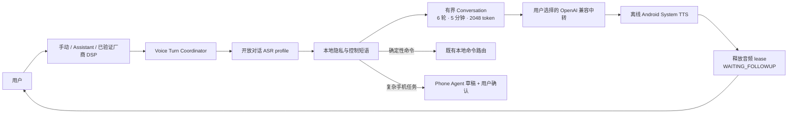
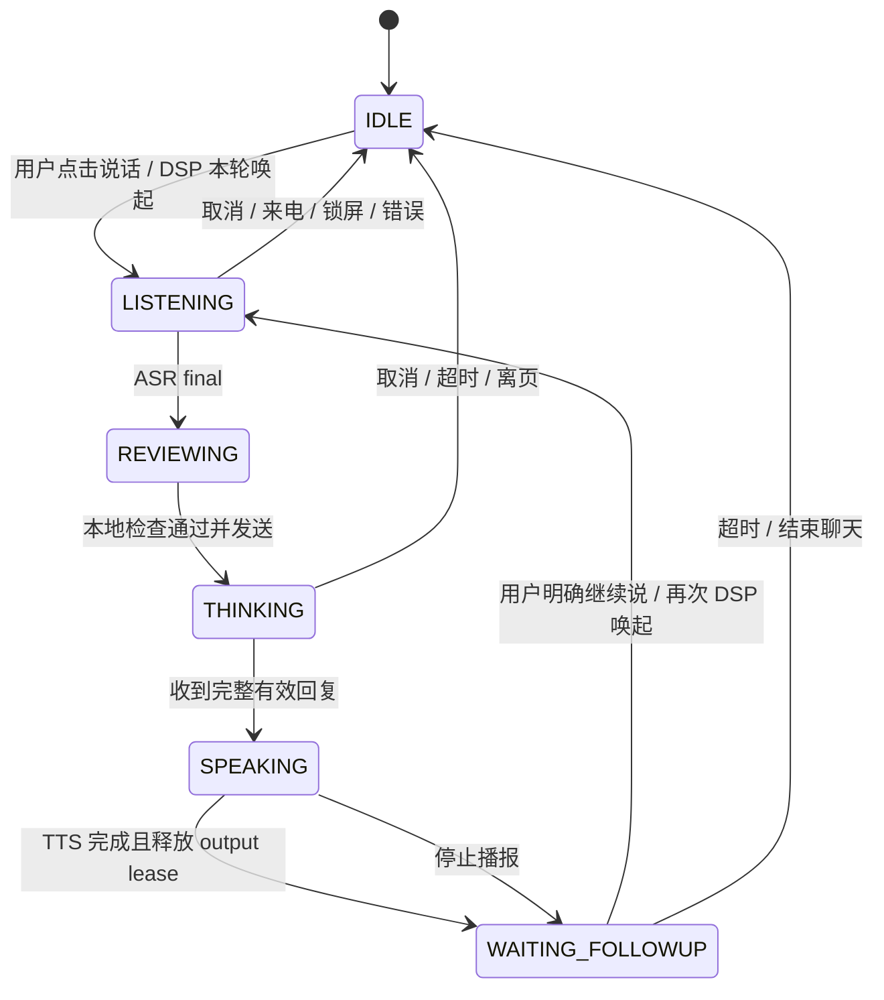

# 小黑自由语音聊天：可执行交付计划

[English](free-voice-chat-delivery-plan.md) · [执行者运行手册](free-voice-chat-executor-runbook.zh-CN.md) · [长期总纲](sovereign-mobile-agent-master-plan.zh-CN.md) · [执行账本](execution-backlog.zh-CN.md) · [当前状态](../STATUS.md)

状态日期：2026-08-11。本文是 `CHAT-005` 以及关联 `VOICE-007/008/009/011/012` 的实施清单，不是能力完成声明。执行者只能把通过了对应证据门禁的项目勾为完成。

## 1. 本轮目标和停手边界

目标是在 OnePlus 8T 上交付一条真实、自然、可停止的中文语音对话链路：

> 用户主动唤起或点击“说话” → 小黑只在本轮录音 → 开放对话 ASR → 隐私检查 → 有界多轮模型 → 离线系统 TTS → 释放全部音频资源 → 等待下一次明确唤起。

第一版采用**低功耗、半双工、逐轮明确唤起**：空闲时只允许已经验证的厂商 DSP 路径常驻；Android CPU 麦克风不得为了等待追问持续打开。播报完成后可以点“继续说”，也可以再次用可用的 DSP 词唤起；不自动重开麦。

本计划阶段不把聊天模型接到 Android、OpenCode 或 root 工具。模型输出仍是纯文字。用户说“帮我操作手机”时，只能进入既有 Phone Agent 草稿与确认链路，不能直接执行。

## 2. 2026-08-11 真实基线

- OnePlus 8T 当前安装的是含本地模型的私有 `0.2.0-alpha.3` 调试包。不得用不含 ASR/KWS 资产的通用 APK 覆盖它。
- 手机系统默认 TTS 是已经验证的离线中文 `com.benjaminwan.chinesettstflite`，Conversation 的 TTS profile 已选择 `system`。
- 手机 Conversation 当前为关闭状态，endpoint/model/token 均未完成真实配置。因此当前只能使用确定性本地 FAQ 和文字页面，不能宣称可自由聊天。
- `ConversationActivity` 已有 6 轮、2048 估算 token、5 分钟、单请求半双工、取消、清空、锁屏/离页清理、离线 FAQ 和系统 TTS 播报。
- `VoiceCommandSession` 只接在 `MainActivity`；聊天路由只把文字预填到 Conversation，仍要求用户点击发送。Conversation 页面本身没有麦克风入口。
- `LocalAsrEngine` 目前强制使用命令热词文件和 `modified_beam_search`。它不能直接当开放聊天 ASR，否则命令热词会污染自由转写。
- 进程级输入/输出 lease、系统 TTS 句子队列、可见停止播报以及真机资源归零已经有证据，勿重复实现。
- Mac 上 CC Switch 的已选中转 profile 已做过一次脱敏 `/models` 可达性检查并返回成功；配置未变化前不要重复该探测。一次聊天探测已经发出过请求，但本地 shell 在收集结果时使用了保留变量而未保存判定；不得用这个不完整结果冒充通过，也不要无条件重复付费探测。
- 规划阶段没有向手机写入 endpoint、model 或 token，没有再发送模型请求，也没有留下临时 UI XML。

## 3. 可用级别与验收口径

| 级别 | 用户体验 | 完成口径 |
|---|---|---|
| L0 当前 | 文字页 + 有限离线 FAQ + 离线播报 | 已有，不等于自由聊天 |
| L1 远端文字聊天 | 手机文字输入能得到真实模型回复并离线播报 | 私有 profile、单次真机请求、取消和断网门禁通过 |
| L2 按键语音聊天 | 点“说话”后完成 ASR → 模型 → TTS，多轮可继续 | `CHAT-005` 自动证据和真机逐轮闭环通过 |
| L3 DSP 逐轮语音 | 息屏 DSP 唤醒，一轮听说后释放 CPU，下一轮再次唤起 | 厂商 DSP 保持低功耗；无常驻 CPU 录音 |
| L4 会话式免触摸 | 显式会话窗口中能连续追问和可听打断 | 真人回声、误触发、来电和功耗门禁通过后才可开启 |

本轮的最低可交付目标是 L2；推荐产品默认是 L3。L4 是后续实验，不能为了“看起来连续”牺牲功耗或隐私。

## 4. 目标架构



聊天正文和模型回复不得直接进入 `ActionDispatcher`、`ToolGateway`、OpenCode runner 或 root broker。语音会话协调器只管理状态、音频所有权和一次用户 turn，不拥有动作权限。



任何终态都必须取消迟到回调并释放录音、TTS、网络请求和 Activity 持有的正文引用。第一版禁止从 `SPEAKING` 自动跳回 `LISTENING`。

## 5. 执行纪律

1. 一次只领取一个未完成且依赖满足的 `FVC-*` 工作包；一个工作包对应一个小 PR。
2. 每次开始先读本页、`STATUS.md`、执行账本和相关证据页；禁止根据聊天记忆猜状态。
3. 不修改或提交未跟踪的 `docs/articles/`；不提交 Token、URL、模型权重、APK、原始语音、UI XML、个人通知或隐私日志。
4. 真实中转只做验收所需的最少调用：配置不变时不重复 `/models`；每个改变后的候选最多做一组预先写明的聊天用例。
5. 相同失败指纹不重试。只有 endpoint/model/网络/代码等条件真实变化后，允许一次恢复尝试，并记录变化。
6. 默认使用文本状态、content description、结构化日志和 AudioFlinger 计数取证；只有语义树无法说明 UI 问题时才截一张最小范围截图。
7. 任何日志只记录结果类别、长度、耗时和代际号；release 构建不得记录转写或模型正文。
8. 物理 OnePlus 构建必须以当前含模型 APK 为输入，验证 ASR/KWS 资产存在和安装 SHA-256；通用无模型 APK 只允许上独立 AOSP。
9. `bash apps/android/xiaohei-android/test.sh`、目标构建、`bash scripts/verify.sh` 和两项 GitHub 必需检查均通过后才能合并。
10. 人耳自然度、回声、真实 ASR 准确率、蓝牙路由、拔线功耗和离线介质恢复只能标 `HUMAN/VERIFY`，自动绿灯不能代替。

## 6. 顺序执行清单

### FVC-000 — 冻结候选与脱敏基线

- [x] 读取 branch/revision/worktree 和最近合并 PR；不碰 `docs/articles/`。
- [x] 只读确认 OnePlus 包版本、默认 TTS、Conversation enabled/profile 字段是否存在、CPU KWS 与 DSP 的独立状态；不得读取或打印 token 明文。
- [x] 记录当前含模型 APK 的来源、签名和哈希；来源不明确时停止安装步骤，但可继续纯 Java/AOSP 开发。
- [x] 在 `STATUS.md` 写明当前 `CHAT-005 / FVC-010`、下一项和唯一阻断，不使用主观百分比。

完成证据：[FVC-000 脱敏基线验收](acceptance-fvc-000.zh-CN.md)。此项不发网络请求、不改手机配置。

### FVC-010 — 安全配置 Conversation 私有中转

依赖：`FVC-000`。

- [x] 从 Mac CC Switch 中按显示名称选择 Conversation profile；只在进程内读取 base URL、token 和模型 ID，不写临时明文文件、不 `echo`、不开 shell trace。
- [x] 将 Anthropic 风格 profile 映射为当前客户端需要的 OpenAI 兼容 base；客户端追加 `/chat/completions` 后必须是正确路径，不得重复 `/v1/v1`。
- [x] 通过小黑公开 Conversation 配置页保存独立 endpoint/model/token，并选择 `system` TTS；不能写到 Phone Agent、OpenCode、Claude/Happy 或 TTS Relay 的 token 槽。
- [x] 保存后只检查 `enabled=true`、endpoint/model 非空、Conversation Keystore 槽“已配置”；不得 dump secret prefs，不得在 token 输入后抓 UI XML/截图。
- [x] 已使用不回显的本地进程内读取与手机公开 UI 输入；Token 未进入聊天、Git、文件或输出。

完成证据：[FVC-010 配置隔离验收](acceptance-fvc-010.zh-CN.md)。回滚：关闭 Conversation、清空 Conversation token 槽，其他 agent/model 渠道逐字不变。

### FVC-020 — 真实文字模型 + 离线 TTS 最小闭环

依赖：`FVC-010`。执行一个固定、无隐私的中文短回复提示、一个固定语言引用追问，以及可见本地“结束聊天”控制。

- [x] 第 1 轮得到非空中文回复，显示 `1/6`，离线 TTS 从 `SPEAKING` 到 `WAITING_FOLLOWUP`。
- [x] 第 2 轮证明历史角色顺序正确，显示 `2/6`。
- [x] 第 3 步不发网络请求并清空内存上下文。
- [x] 在途取消与迟到 callback 由全量本地测试覆盖；真实中转不重复消耗 Token。
- [x] 已有 `CHAT-011` AOSP 证据验证关闭 Conversation 后的精确 FAQ/未知拒绝，本次不破坏已工作的私有 profile 去重复。
- [x] 成功 turn 后 TTS 完成，结束聊天后无活跃小黑录音客户端；完整自动矩阵无 Fatal/ANR。

完成证据：[FVC-020 真实文字模型与离线 TTS 验收](acceptance-fvc-020.zh-CN.md)。失败只记录固定指纹；条件不变不重试。此项完成后只可宣称 L1。

### FVC-030 — 建立独立开放对话 ASR profile

依赖：`FVC-000`；映射 `VOICE-008`。代码骨架不必等待真人 A/B。

- [x] 新增显式 `COMMAND` / `CONVERSATION` ASR profile，命令会话默认行为保持不变。
- [x] `COMMAND` 保留命令热词与有限同音归一化；`CONVERSATION` 不加载命令热词、不调用 `CommandRouter` 归一化。
- [x] profile 通过受限 Intent extra 或构造参数传到 `XiaoheiRecognitionService` / `LocalAsrEngine`；未知值 fail closed，不静默选命令模式。
- [x] Conversation profile 仍限制 8 秒、`zh-CN`、最多一个 final；partial 只显示，不发送模型。
- [x] 为未来 A/B 保留 `local_command_14m`、`local_conversation_candidate`、`android_system` 标识；未安装 provider 必须显示不可用，不能自动下载或切换。
- [x] 测试 profile 隔离、未知值、取消、空结果、迟到 partial/final、命令热词只被命令 profile 引用。

完成证据：[FVC-030 开放对话 ASR profile 验收](acceptance-fvc-030.zh-CN.md)。不得据此宣称真人转写准确。

### FVC-040 — Conversation 单轮“说一句、答一句”

依赖：`FVC-020`、`FVC-030`；映射 `CHAT-005`。

代码级子门禁 `FVC-040A` 已通过：见 [单轮语音代码门禁验收](acceptance-fvc-040.zh-CN.md)。它只证明顺序、状态和资源释放接线；`FVC-040B` 的 OnePlus 真人闭环仍是必需门禁。

- [x] 在 Conversation 添加独立“说话”按钮和可读状态，不复用主页命令按钮的路由副作用。
- [x] 新建纯 Java `ConversationVoiceTurnCoordinator`，只允许 `IDLE/LISTENING/REVIEWING/THINKING/SPEAKING/WAITING_FOLLOWUP/STOPPED/FAILED` 合法转换。
- [ ] 点击说话先停止当前 TTS，再获取 input lease；获取失败只显示原因，不排队偷偷开麦。
- [ ] partial 只更新临时转写；final 经本地隐私策略和精确控制短语后自动发送一个聊天 turn。聊天无动作权限，因此首版无需再点“发送”；仍保留文字编辑回退。
- [ ] 空结果、错误、取消和超时都释放 input lease，模型调用为 0。
- [ ] THINKING/SPEAKING 禁止录音；TTS 完成只进入 `WAITING_FOLLOWUP`，不自动开麦。
- [ ] “停止播报”只停 TTS 并保留上下文；“停止”取消 ASR/HTTP/TTS 并暂停；“结束聊天”再清空正文。
- [ ] 锁屏、离页、destroy、全局停止和配置变化取消 ASR/HTTP/TTS 三条代际并遵循现有清理规则。

自动验收覆盖成功、空 ASR、ASR 取消、HTTP 失败/取消、TTS 失败、锁屏、离页、配置变化、重复 final、迟到 callback、连续点击和 lease 冲突；`modelCalls` 必须精确。

### FVC-050 — 半双工多轮语音追问

依赖：`FVC-040`。

代码级子门禁 `FVC-050A` 已通过：见 [半双工多轮语音代码门禁验收](acceptance-fvc-050.zh-CN.md)。它不替代 `FVC-050B` 的 OnePlus 两轮真实声学与资源验收。

- [ ] `WAITING_FOLLOWUP` 显示“继续说”，一次点击只开启一个新 ASR turn。
- [ ] 语音和文字共用同一 6 轮/2048 token/5 分钟 coordinator，不能各有隐形上下文。
- [ ] 精确语音控制“停止/重说/清空/继续聊/结束聊天”走本地 `ConversationControlPolicy`，模型调用为 0。
- [ ] TTS 未结束时点“继续说”，先明确停止播报再开麦；input/output lease 永不重叠。
- [ ] 达到轮数/token/时间上限后按现有规则清空并回到 `IDLE`，不能自动监听。
- [ ] 会话中切模型时取消在途工作并清空上下文，要求重新开始。

完成证据：两轮指代真人演示、6 轮边界自动测试、取消/超时/切模型矩阵，远端调用数与完成 turn 精确对应。

### FVC-060 — DSP 进入语音聊天但不常驻 CPU 麦克风

依赖：`FVC-040`；不依赖自定义“小黑小黑”DSP 资产。

- [x] 保留已验证厂商 DSP 唤醒词和短命令入口；不把 CPU KWS 标成 DSP。
- [x] 新增“陪我聊会儿/开始聊天”等明确意图，由 DSP 唤起后的本轮 ASR 进入 Conversation 语音 turn，而非只预填文字。
- [x] 没有合法、实测的自定义 DSP 模型前，继续使用当前已验证厂商词；不宣称息屏“小黑小黑”可用。
- [ ] 每轮 ASR 后立即释放 Android 录音器并按既有 OnePlus profile re-arm DSP；模型等待/TTS 不启动 CPU KWS。
- [ ] TTS 播报期间收到 DSP callback 时按确定性策略拒绝或停止播报，不能同时录音形成回声环。
- [ ] CPU KWS 验收前后保持 OFF，且不联动 DSP/Conversation。

部分证据：[FVC-060 DSP 进入聊天的部分验收](acceptance-fvc-060.zh-CN.md)。完整真机证据仍须：息屏唤起 → 开放问句 → 非空转写 → 一次远端回复 → 离线播报 → DSP 重新 `ARMED`；终态无 Active Record Client。此项才可宣称 L3。

### FVC-070 — 中断、电话与资源释放

依赖：`FVC-040`；映射 `VOICE-005/011`。

- [ ] Activity pause、锁屏、全局停止自动矩阵通过。
- [ ] 来电分别发生在 LISTENING、THINKING、SPEAKING：立即取消对应资源，不自动恢复、不补发旧回复。
- [ ] 闹钟/导航/媒体焦点丢失至少各做一次真实信号；不保存私人通话或音频。
- [ ] 真人确认“停止播报”可听停止不超过 300 ms；旧的 227 ms 引擎/音轨证据不能代替人耳。
- [ ] TTS 一旦被 ASR 当成追问，立即关闭自动追问实验，保留逐轮明确唤起。

记录每个中断源的起始/终态、Recorder、TTS track、DSP/CPU KWS 和模型调用。需用户打电话时只提示一次，不循环截图或轮询。

### FVC-080 — 开放中文 ASR A/B 和选型

依赖：`FVC-030`；最终发布依赖 `VOICE-007` 人类门禁。

- [ ] 按 `voice-evaluation-protocol.zh-CN.md` 冻结 30–50 条真人中文开放问句、噪声/距离分层和判定规则；原始音频不入 Git。
- [ ] 对比当前 14M 命令模型、无命令热词开放 profile，以及一个资源可接受的更强候选或系统识别。
- [ ] 同一条预注册音频每候选只跑一次；不得反复说到识别正确。
- [ ] 测语义成功率、WER、首 partial/final 延迟、峰值 RSS、CPU 时间、APK/模型增量。
- [ ] 选型优先“问句语义正确 + 手机资源可接受”；更强模型不得仅凭开放听写结果替换命令 profile。
- [ ] 只改变 Conversation ASR，不改变命令 ASR、DSP、TTS 或模型渠道。

无真人样本时保持 `HUMAN`；它不阻塞 FVC-040 工程骨架，但阻塞“自然可用”声明。

### FVC-090 — 蓝牙、耳机与扬声器矩阵

依赖：`VOICE-011` 真人门禁；映射 `VOICE-012`。

- [ ] 扬声器、听筒（若支持）、有线耳机、蓝牙耳机分别验证 input/output route。
- [ ] 连接、断开、切换时停止当前 turn、释放旧 route，再由用户明确开始；旧音频不能续播到新设备。
- [ ] 与电话/闹钟叠加时遵循 FVC-070，不自动恢复。
- [ ] 不支持的 route 显示明确状态并安全回退，不循环重连。

该项不阻塞扬声器首个 L2/L3 预览，但公开支持矩阵必须准确。

### FVC-100 — 从聊天到手机动作的安全交接

依赖：`FVC-050`。不属于 `CHAT-005` 完成条件，但属于长期产品闭环。

- [x] 模型回复即使包含 JSON、工具名或“已替你完成”，也只能显示/播报。
- [x] 只有用户原始语音可进入确定性短命令路由；模型回复永不进入。
- [x] 复杂任务只生成 Phone Agent 可编辑草稿，必须审阅计划/目标/风险/回滚并新鲜确认。
- [x] 语音“确认”不能代替 L2/L3 动作的可见确认，除非未来另过防回放、身份和内容绑定门禁。
- [x] 支付、转账、OTP、密码和规避风控永久拒绝。

完成证据：[FVC-100 聊天到动作安全交接验收](acceptance-fvc-100.zh-CN.md)。未来真实工具仍须单独适配器验收。

### FVC-110 — 自动化、AOSP 与 OnePlus 验收

依赖：目标工作包代码完成。

- [x] 纯 Java：状态机、profile 隔离、代际取消、重复 final、预算、控制短语、隐私、音频 lease、失败指纹。
- [x] 静态门禁：Conversation 无动作路径；release 无正文日志；Conversation Token 只进其 Authorization header。
- [x] AOSP：无模型公开构建可安装，系统 ASR 状态诚实，mock 两轮，`am force-stop` 后零录音/Fatal/ANR；见 [FVC-110 自动与静态验收](acceptance-fvc-110.zh-CN.md)。
- [ ] OnePlus：保留模型资产的候选完成 L2 两轮、取消、断网、全局停止和一次 DSP L3。
- [ ] 网络故障只测最小可控集合；同一错误不重复烧 token。
- [ ] 结束后恢复用户选择的 Conversation profile、CPU KWS OFF；不改变 DSP、OpenCode、Claude/Happy 或 Phone Agent。

部分证据：[FVC-110 自动与静态验收](acceptance-fvc-110.zh-CN.md)。设备和真人门禁仍必须完成。

Git 只保留脱敏结构化结果；APK、模型、原始音频、私有 URL/Token、UI dump 均不入库。

### FVC-120 — 真人产品验收

依赖：`FVC-110`；对应 `VOICE-007/011` 与 `CHAT-012`。

- [ ] 安静近讲 5 问、正常房间 5 问、1–2 米 5 问、轻噪声 5 问。
- [ ] 两轮指代 3 组；停止播报 5 次；识别失败后自然恢复 3 次。
- [ ] 确认中文音色自然可懂、状态明确、没有 TTS 回声被再次识别。
- [ ] 至少一次来电中断；结束后不自动录音或续播。
- [ ] 最终无 Active Record Client、无残留请求，DSP/CPU KWS 状态与界面一致。

关键项失败就让 `CHAT-012` 保持 `VERIFY`，记录一个失败指纹和恢复条件，不靠重复尝试改写结果。

### FVC-130 — 双语文档、发布和合并

依赖：相应发布范围的门禁完成。

- [ ] 更新中英文 README、操作卡、架构、兼容性、隐私/数据流、故障排查、账本、证据矩阵、`STATUS.md` 和 release notes。
- [ ] 区分“按键语音聊天”“DSP 逐轮聊天”“实验性免触摸”“聊天转动作”，不得笼统写“语音助手已完成”。
- [ ] 公开文档不含私有中转名称/URL/Token、模型权重、设备序列号或原始语音。
- [ ] 从最终 revision 重建 source-only 工件、SBOM、provenance 和扫描；公开 APK 遵循许可证/资产边界。
- [ ] 独立 AOSP 做安装/升级/回退/卸载；OnePlus 只安装匹配签名且保留私有模型资产的候选。
- [ ] PR 逐个审核 diff、秘密扫描、依赖和证据；两项必需 CI 通过后合并，再回读 main revision 和开放 PR。

若只剩真人声学、拔线功耗或离线介质门禁，可以发明确标注的预览版，但相应任务不能写 `DONE`。

## 7. 最小验收矩阵

| 场景 | 模型调用 | 音频 | 终态 |
|---|---:|---|---|
| ASR 空结果 | 0 | 短时输入，零输出 | 可解释失败/等待追问，lease 归零 |
| 正常一轮 | 1 | 输入后输出，绝不重叠 | `WAITING_FOLLOWUP` |
| 两轮指代 | 2 | 每轮输入后输出 | `2/6`，历史只在内存 |
| ASR 时停止 | 0 | 输入立即释放 | paused，零迟到发送 |
| 模型时停止 | 已发 1，接受回复 0 | 无 TTS | paused，迟到流丢弃 |
| TTS 时停止播报 | 不新增 | ≤300 ms 人耳停止 | 保留上下文，不自动开麦 |
| 精确“结束聊天” | 0 | 零录音 | 正文清空 |
| 锁屏/离页/来电 | 不新增 | 输入输出释放 | 不自动恢复 |
| 远端断网 | 1 个失败请求 | 精确 FAQ 才播报 | 未知不猜、不重试 |
| 模型伪造工具调用 | 1 | 只播报安全文字/拒绝 | 0 动作、0 capability |
| DSP 逐轮 | 每有效问句至多 1 | DSP → input → output → DSP | Recorder 归零，DSP re-arm |

## 8. 人类进度入口

人类只看两个文件：

1. [`STATUS.md`](../STATUS.md)：当前可用、下一项、阻断、最近 PR、真人门禁。
2. 本页：第一个未勾选且依赖满足的 `FVC-*`。

每个执行 PR 合并后必须更新：

```text
Current: FVC-xxx + 状态
Next:    下一项且依赖满足的 FVC-xxx
Blocker: 唯一失败指纹 / HUMAN / NONE
PR:      编号 + 合并 revision
Evidence: 自动 / AOSP / OnePlus / HUMAN 各自状态
```

不要报告“完成 80%”。任务只使用 `BACKLOG/READY/IN_PROGRESS/VERIFY/HUMAN/BLOCKED/DONE`，`DONE` 必须链接可复查证据。

## 9. 交给下一个执行模型的启动指令

> 阅读 `docs/free-voice-chat-delivery-plan.zh-CN.md`、`STATUS.md`、`docs/execution-backlog.zh-CN.md` 和相关证据页。先执行第一个未完成且依赖满足的 `FVC-*`，一次只做一个工作包；实现、测试、记录脱敏证据、提交小 PR、等待两项必需 CI、审核后合并，再更新本页与 `STATUS.md`。保留 `docs/articles/`，不提交或输出 Token、URL、模型、APK、原始语音、隐私日志或 UI XML。配置不变时不重复 `/models` 或付费聊天探测；相同失败指纹不重试。OnePlus 不得安装通用无模型 APK。遇到真人听感、电话、拔线功耗或离线介质门禁时准确标 `HUMAN` 并停止该项，不虚报通过。
