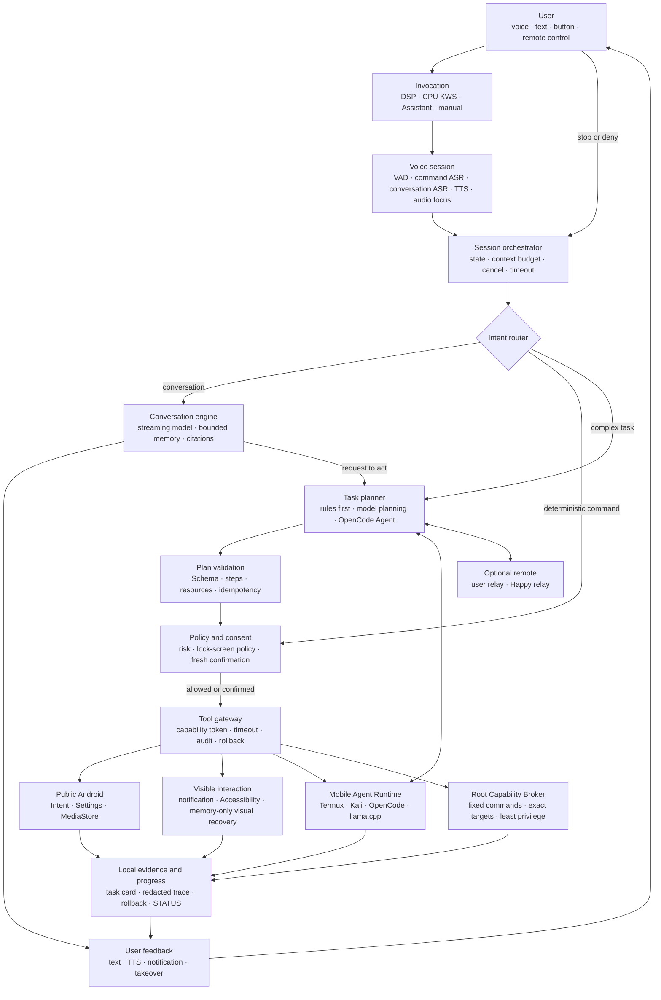

# Xiaohei Sovereign Mobile Agent: Long-Term Product and Engineering Plan

[简体中文](sovereign-mobile-agent-master-plan.zh-CN.md) · [Execution backlog](execution-backlog.md) · [Current status](../STATUS.md) · [Delivery evidence](delivery-evidence-matrix.md)

Status: long-term direction, not a completion claim. The evidence matrix and exact acceptance records remain authoritative.

## 1. Product definition

Xiaohei is not a chat window added to a phone. It turns a mobile, optionally rooted Android device that can run OpenCode, Termux, Kali, and local AI runtimes into a personal agent that can **understand, plan, act, explain, stop, and recover**.

Its differentiator is action with control:

- The device is simultaneously the user interface, sensor, executor, and security boundary.
- Deterministic commands stay local; only ambiguous conversation or complex planning uses a selected model or OpenCode Agent.
- Android intents, notifications, Accessibility, Termux, a constrained root broker, and an optional relay are layered tools—not unlimited model authority.
- Every action has a target, risk decision, authorization, observed result, and rollback evidence.
- Conversation, model profiles, wake backends, and service lifecycles remain independent.

North-star experience:

> “Xiaohei, summarize the important messages today, organize yesterday's test screenshots into my project folder, and tell me what happened.”
>
> Xiaohei explains the notification and file scope first. After confirmation it observes, plans, and performs reversible work locally, stops on sensitive or ambiguous surfaces, and reports the result through speech and a visible task card.

## 2. Capability is not authorization

Root, OpenCode, and a capable model raise the ceiling, but “anything is possible” is not a security policy.

| Level | Example | Default policy |
|---|---|---|
| L0 Observe | Device state, public notification counts, read-only file metadata | Execute with a redacted result |
| L1 Low risk | Open an app, gallery, settings, weather | Execute visibly and remain stoppable |
| L2 Reversible change | Move ordinary files, change volume, create a draft | Preview target and rollback first |
| L3 High impact | Send, delete, install, grant, call, root system change | Fresh confirmation bound to target/content; dedicated broker only |
| L4 Denied | Payment, transfer, OTP/password, evasion, destructive bulk work | Never execute through model, OpenCode, or root |

Root is exposed only through a versioned allowlisted **Root Capability Broker**; the model never receives generic `su -c`. OpenCode runs in a task workspace behind the tool gateway and never directly owns Android privileges, private keys, or complete personal data.

## 3. Target architecture



The model proposes; it cannot bypass `Schema → Policy → Tool Gateway`. Observed tool results return to the evidence layer before Xiaohei reports success.

## 4. Standard complex-task flow

```mermaid
sequenceDiagram
    participant U as User
    participant X as Xiaohei orchestrator
    participant M as Conversation/planning model
    participant P as Policy and consent
    participant T as Tool gateway
    participant D as Android/Termux/OpenCode/Root

    U->>X: “Organize yesterday's test screenshots and write a summary”
    X->>X: ASR, intent, privacy, and lock-state checks
    X->>M: Minimum context plus allowed tool descriptions
    M-->>X: Versioned plan; no execution authority
    X->>P: Validate steps, targets, risk, rollback, and budget
    P-->>U: Show read scope, destination, and expected steps
    U-->>P: Confirm this task
    loop One execution and at most one evidence-changing recovery per step
        P->>T: Issue a short-lived capability token
        T->>D: Execute an exact tool call
        D-->>T: Structured result and new device snapshot
        T-->>X: Append a redacted trace
        X->>X: Verify observed state rather than model prose
    end
    X-->>U: TTS + task card with result, failures, and rollback
```

## 5. Core subsystems

### Conversation and voice

- Separate command ASR from open-ended conversation ASR; command hotword correction must not rewrite chat.
- Begin half-duplex: listen, stop recording, then speak. Add streaming ASR/TTS, barge-in, Bluetooth routing, and echo handling later.
- Keep bounded short-term context in memory by default. Persistent memory is opt-in, inspectable, erasable, and independently disabled.
- Select system-offline or relay TTS through an adapter; never hard-code one vendor.
- The implemented single-turn network boundary is specified in [Bounded Conversation Transport](conversation-transport.md); it is text-only and carries no action authority.

### Session and task orchestration

- Every request has a unique task id, max steps, total timeout, token/screenshot/network budgets, and cancellation state.
- Deterministic routing wins. Models handle conversation, ambiguity, and complex planning only.
- Plans must validate against a versioned schema. Unknown tools, parameters, or targets fail closed.
- Re-observe after every step. Retry once only when evidence shows the condition changed.

### Tools and phone control

Preferred order: public Android API → semantic Accessibility → user-invoked memory-only visual recovery → Termux/OpenCode → constrained root broker. Later layers require stronger consent and evidence.

The catalog includes Android activities/settings/media, notification summaries and confirmed drafts, calendar/reminders/files, semantic UI actions, Termux diagnostics/Git/OpenCode workspaces, and allowlisted root diagnostics/service/backup/profile operations.

### OpenCode and models

- OpenCode is an executor for engineering and file tasks, not a direct owner of root.
- Xiaohei creates a task workspace, short-lived capability token, and budget through a loopback gateway before invoking OpenCode.
- Conversation, Phone Agent, OpenCode, and Claude/Happy retain independent active profiles even when they reuse a credential source.
- A 0.6B local model is limited to classification, fixed FAQ, privacy rewrite, and offline explanation; complex planning uses the user's selected remote model.

### Security, privacy, and recovery

- Credentials stay in Android Keystore or controlled private files, never prompts, screenshots, logs, or Git.
- Raw audio is not retained by default. Screenshots are memory-only and not uploaded unless a future explicit, scoped product consent says otherwise.
- Lock screen permits only low-risk allowlisted actions.
- Global stop cancels voice, model streams, OpenCode tasks, Accessibility actions, and capability tokens.
- Define rollback before enabling each privileged feature; uninstall verifies DSP, recording, root tasks, and background processes are released.

## 6. Repository responsibilities

| Repository | Owns | Does not own |
|---|---|---|
| `xiaohei-phone-agent` | Product, orchestration, policy, tool contracts, Android actions | Private models, generic pentest scripts, relay operations |
| `android-ai-stack` | OpenCode/Claude/Happy/llama.cpp runtime and independent profiles | Xiaohei permissions and action policy |
| `android-device-test` | Reusable device/emulator evidence harness | Product-specific selectors and user data |
| `pocket-pentest` | Authorized Android/Termux/Kali capabilities | Default consumer dependency or free-form model root |
| `happy-relay-deploy` | Optional remote control and relay deployment | Required local functionality |
| `oneplus-8t-mobile-lab` | Umbrella navigation, cases, tutorials, release map | Vendored product source |

## 7. Delivery stages

| Stage | Goal | Exit gate |
|---|---|---|
| S0 Baseline | Preserve existing wake, short command, Phone Agent, and rollback evidence | Evidence matrix consistent; physical gates remain honest |
| S1 Speaking assistant | Single-turn ASR → model → TTS with visible stop | Human Mandarin QA, call interruption, zero recorder residue, no action authority |
| S2 Half-duplex dialog | Bounded 3–8-turn conversation and follow-up window | Context/timeout/model-switch/lock-screen tests; no persistence by default |
| S3 Dialog to action | Convert an action request into confirmed `ActionRequest` | Model cannot bypass policy; low-risk and denial matrices |
| S4 Mobile tool platform | Files, calendar, notifications, media, and 15+ app tools | Semantic-first, re-observe, rollback, 100-task stress |
| S5 OpenCode executor | Workspace-scoped engineering/file tasks | No generic root, bounded/cancellable, no credentials, clean task teardown |
| S6 Constrained root | Fixed broker for diagnostics, services, backup, profiles | Exact target, fresh confirmation, destructive-denial tests |
| S7 Proactive/personal | Optional reminders, context, memory, multi-device | Off by default, explainable triggers, erase controls, privacy qualification |
| S8 Release/ecosystem | Generic APK, OnePlus profile, docs, reproducible release | Bilingual docs, SBOM, provenance, power, rollback, signing recovery |

See the [execution backlog](execution-backlog.md) for ordered task cards. A less-capable model must work by task id and dependency, not infer changes directly from this vision.

## 8. Human progress view

[`STATUS.md`](../STATUS.md) is the one-page human entry point. It answers what works, what is active, what comes next, which human/device gates remain, and the latest reviewable evidence or PR.

Every implementation PR updates `STATUS.md`, the execution backlog, the relevant acceptance record, and the evidence matrix only when an exit gate is genuinely satisfied. A GitHub Project may mirror five columns: `Inbox → Ready → In progress → Verify → Done`, with `human-gate`, `device-gate`, `security`, and `release` labels. Keep at most one task in progress per workstream.

## 9. Definition of done

A capability is done only when the real user path executes; success, denial, cancel, timeout, interruption, and rollback have evidence; privileges and data remain minimal; public artifacts contain no private audio/images/credentials/endpoints/device identifiers; bilingual docs match behavior; and automated plus device gates pass in a reviewed and merged PR.

The goal is not a model with many tools. It is a phone powerful enough to act and trustworthy enough that its owner always knows why it is acting, what it is doing, when it will stop, and how to recover.
