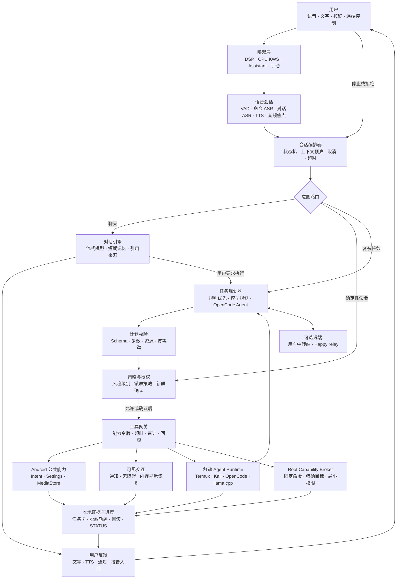
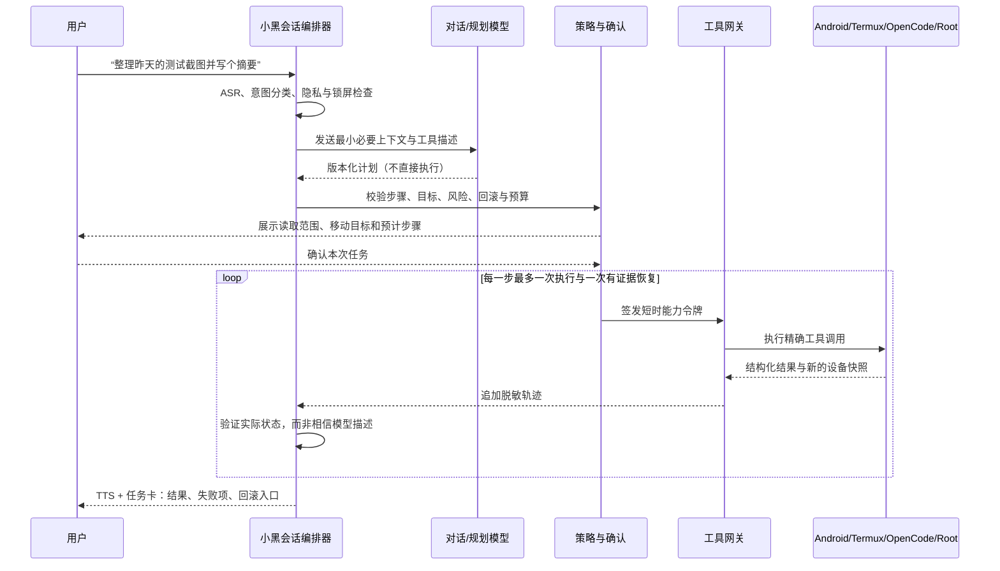

# 小黑主权移动智能体：长期产品与工程总纲

[English](sovereign-mobile-agent-master-plan.md) · [执行任务账本](execution-backlog.zh-CN.md) · [当前状态](../STATUS.md) · [交付证据矩阵](delivery-evidence-matrix.zh-CN.md)

状态：长期方向文档，不是已完成能力声明。任何“已完成”结论以证据矩阵和精确验收记录为准。

## 1. 产品定义

小黑不是给手机加一个聊天窗口，而是把一台可移动、可离线、可 root、可运行 OpenCode/Termux/Kali 的 Android 设备，变成一个**能理解、能规划、能执行、能解释、能停止、能回滚**的个人智能体。

它的核心差异不是“更会聊天”，而是：

- 对话发生在用户随身携带的设备上，设备本身就是传感器、执行器和安全边界。
- 固定命令本地确定性执行；复杂任务才交给用户选择的模型或 OpenCode Agent。
- Android Intent、通知、无障碍、Termux、受控 root broker 和远端 relay 是分层工具，不是模型拥有的无限权限。
- 每个动作都必须有目标、风险、授权、结果和回滚证据。
- 聊天、模型配置、唤醒后端和服务生命周期相互独立，任何一项切换都不能暗中改变其他项。

北极星体验：

> “小黑小黑，帮我看看今天有哪些重要消息，再把相册里昨天拍的测试截图整理到项目目录，最后告诉我结果。”
>
> 小黑先解释将读取哪些通知和文件；用户确认后，它在手机本地完成观察、规划和可逆操作，遇到敏感页面或歧义立即停下请求接管，最后用语音和任务卡汇报结果。

## 2. 能力不等于无限授权

Root、OpenCode 和聪明模型让手机拥有很高的能力上限，但“无所不能”不能成为安全模型。产品必须把能力拆成五级：

| 等级 | 典型能力 | 默认策略 |
|---|---|---|
| L0 观察 | 设备状态、公开通知计数、只读文件元数据 | 可执行并记录脱敏结果 |
| L1 低风险动作 | 打开 App、相册、设置页、查询天气 | 可执行，必须可见和可停止 |
| L2 可逆修改 | 移动普通文件、调整音量、创建草稿、切换非敏感配置 | 预览目标与回滚方式后执行 |
| L3 高影响动作 | 发送、删除、安装、授权、拨号、root 修改系统 | 绑定目标和内容的新鲜确认；使用专用 broker |
| L4 默认禁止 | 支付、转账、验证码、密码、绕过平台风控、破坏性批量操作 | 模型、OpenCode 和 root 都不得执行 |

Root 只通过版本化、允许列表化的 **Root Capability Broker** 暴露最小动作；模型不得得到通用 `su -c`。OpenCode 只在任务工作区和工具网关内工作，不能直接持有 Android 高权限、私钥或完整用户数据。

## 3. 目标架构

这张图的关键是：模型只能提出计划，不能越过 `Schema → Policy → Tool Gateway`。工具执行结果必须回到证据层，再由小黑对用户说明。

## 4. 一次复杂任务的标准流程

## 5. 核心子系统

### 5.1 对话与语音

- 命令 ASR 与开放对话 ASR 分离；命令热词纠错不能污染聊天文本。
- 第一阶段采用半双工：听完再说；播报完成后才重新开麦。
- 后续加入流式 ASR、按句流式 TTS、用户插话停止、蓝牙/耳机路由和 AEC。
- 对话默认只保留内存中的有界上下文；长期记忆默认关闭、可查看、可删除。
- TTS 通过适配器选择系统离线音色或用户中转站，不把单一厂商服务写死。
- 已实现的单轮网络边界见 [Conversation 有界传输](conversation-transport.zh-CN.md)；它只返回文字，不携带任何动作权限。

### 5.2 会话与任务编排

- 一个用户请求对应唯一任务 ID、最大步骤、总超时、token/截图/网络预算和取消标志。
- 固定命令优先走本地路由；模型只处理开放聊天、歧义或复杂计划。
- 规划模型输出必须符合版本化 Schema；未知工具、未知参数和越界目标直接拒绝。
- 每步执行后重新观察；相同失败指纹只有条件改变后才能重试一次。

### 5.3 工具与手机控制

工具按优先级选择：公开 Android API → 语义无障碍 → 用户同意的一次内存视觉恢复 → Termux/OpenCode → 受控 root broker。越靠后权限越高、确认和证据要求越严格。

工具目录至少包含：

- App/Activity、设置、相册、相机、浏览器、地图、拨号盘。
- 通知汇总、确认式消息草稿、日历、提醒、媒体和文件。
- 无障碍语义点击、输入、滚动、返回和执行后重新观察。
- Termux 文件/进程/网络诊断、Git、OpenCode 工作区任务。
- Root 只读诊断、受控服务生命周期、备份/恢复和设备 profile 操作。

### 5.4 OpenCode 与模型

- OpenCode 是复杂工程和文件任务的执行器，不是 Android root 权限的直接持有者。
- 小黑通过本机 loopback Tool Gateway 创建一次性工作区、能力令牌和预算，再把任务交给 OpenCode。
- Conversation、Phone Agent、OpenCode、Claude/Happy 各有独立 active profile；可复用凭据来源，但不联动配置。
- 本地 0.6B 模型只做分类、固定 FAQ、隐私改写和断网解释；复杂规划使用用户选择的远端模型。

### 5.5 安全、隐私和恢复

- Token 进入 Android Keystore/受控私有文件，不进入 Prompt、截图、日志或 Git。
- 原始语音默认不持久化；截图默认不上传、不落盘，任务结束立即释放。
- 锁屏只允许白名单低风险动作；隐私通知、消息正文、联系人和位置按需最小化。
- 全局停止必须同时取消语音、模型流、OpenCode 任务、无障碍动作和短时能力令牌。
- 每项高权限能力先定义回滚，再定义启动；卸载前验证 DSP、录音、root 任务和后台进程均已释放。

## 6. 跨仓职责

| 仓库 | 唯一职责 | 不应承担 |
|---|---|---|
| `xiaohei-phone-agent` | 用户产品、会话编排、策略、工具契约和设备动作 | 私有模型、通用渗透脚本、远端 relay 运维 |
| `android-ai-stack` | OpenCode/Claude/Happy/llama.cpp 运行时与独立模型 profile | 小黑产品权限与动作策略 |
| `android-device-test` | 可复用真机/模拟器证据采集与验收 harness | 产品专属 selector 和用户数据 |
| `pocket-pentest` | 经授权的 Android/Termux/Kali 能力与安全实验 | 普通用户默认依赖、模型自由 root |
| `happy-relay-deploy` | 可选远端控制和 relay 部署 | 本地基础能力的必需依赖 |
| `oneplus-8t-mobile-lab` | 伞状导航、组合案例、教程和发布地图 | vendoring 各产品源码 |

## 7. 分阶段交付

| 阶段 | 目标 | 出口门禁 |
|---|---|---|
| S0 基线冻结 | 保持现有唤醒、短命令、Phone Agent 和回滚证据可靠 | 当前 M0–M7 证据矩阵一致；功耗和真人门禁不虚报 |
| S1 会说话的助手 | 单轮 ASR → 模型 → TTS；可见停止 | 真人中文问答、来电中断、零录音残留、无动作权限 |
| S2 半双工多轮 | 3–8 轮有界聊天、追问窗口、会话清除 | 上下文/超时/切模型/锁屏测试；默认不落盘 |
| S3 聊天到行动 | 聊天请求转为 ActionRequest，再确认执行 | 模型不能越过策略；10 条低风险和 10 条拒绝用例 |
| S4 移动工具平台 | 文件、日历、通知、媒体和 15+ App 工具 | 语义优先、执行后验证、回滚、100 任务压力 |
| S5 OpenCode 执行器 | 本机工程/文件任务使用临时工作区和能力令牌 | 无通用 root、预算可停、无凭据泄漏、任务可清理 |
| S6 受控 Root | 只读诊断、服务、备份与 profile 使用固定 broker | 固定命令、精确目标、新鲜确认、破坏性拒绝测试 |
| S7 主动与个性化 | 日程/通知提醒、可选记忆和多设备 | 默认关闭、可解释触发、可删除、隐私与误触发门禁 |
| S8 发布与生态 | 通用 APK、OnePlus profile、文档和可复现 Release | 双语、SBOM、provenance、功耗、回滚、签名恢复 |

每个阶段的可执行任务见[执行任务账本](execution-backlog.zh-CN.md)。较弱模型必须按任务依赖顺序工作，不能从愿景直接推导代码改动。

## 8. 人类如何随时掌握进度

仓库根目录的 [`STATUS.md`](../STATUS.md) 是人类入口，只回答五个问题：

1. 现在可用什么？
2. 当前正在做哪一项？
3. 下一项是什么？
4. 哪些地方需要真人、设备或外部介质？
5. 最近一条可复核证据和 PR 是什么？

每个实现 PR 必须同时更新：

- `STATUS.md`：面向人类的一页状态。
- `execution-backlog*.md`：任务状态和下一依赖。
- 对应 acceptance 文档：实际步骤、期望、结果、失败指纹和回滚。
- `delivery-evidence-matrix*.md`：只有出口门禁全部满足才升级里程碑状态。

建议 GitHub Project 使用五列：`Inbox → Ready → In progress → Verify → Done`，并用 `human-gate`、`device-gate`、`security`、`release` 标签。一次最多一个任务处于 `In progress`；否则较弱模型容易跨范围和重复测试。

## 9. 完成定义

一项能力只有同时满足以下条件才算完成：

- 用户路径真实执行，而不是仅有代码、进程或 HTTP 200。
- 正常、拒绝、取消、超时、中断和回滚路径均有证据。
- 目标 App、权限、模型、root 和网络范围符合最小权限。
- 没有原始音频、私密截图、Token、私有 URL 或设备标识进入公开工件。
- 中英文文档与当前行为一致。
- 对应自动检查和真机/模拟器门禁通过，PR 已复核并合并。

小黑的终点不是“模型能调用很多工具”，而是用户可以放心把一台强大的移动设备交给它：知道它为什么行动、正在做什么、什么时候会停，以及出错后如何恢复。
